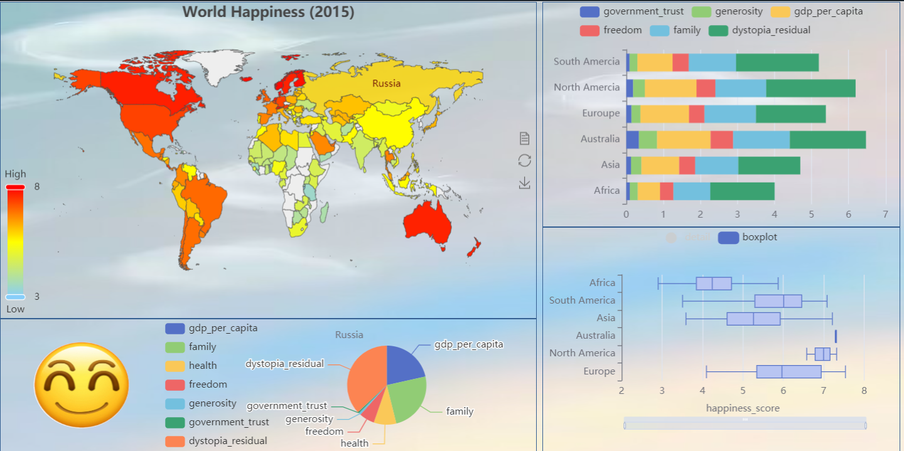

# Interactive-Dashboard
# 2015年全球各国幸福感指数可视化

> 项目成员：
>
> 李佳怡、胡彦蓉、刘妍、刘铭心、訾雪晗

现代化社会给人类带来的一个重要成就无疑是物质生活条件的不断改善和生活质量的日益提高。然而，在各国经济增长和逐渐繁荣的同时，主观幸福并没有随着客观福祉的提高呈现相应的上升趋势。例如：有调查显示，中国经济最为发达的北京、上海、深圳、浙江等省市幸福感指数最低，2009年红火的地产业带来的房价飙升令很多家庭感到痛苦。此外，健康、情商、财商、家庭责任以及社会环境被绝大多数被调查者认为是影响家庭幸福最重要的因素，且这五者相互关联，缺一不可。

本项目，使用交互式仪表盘对2015年全球各国幸福感指数数据进行可视化，用户可以进行交互式探索，以获取更多信息。本项可以用于分析各个因素对不同国家和地区的幸福感指数的影响等信息。

### 数据集：

我们使用2015年全球各地幸福感指数数据，数据中包括国家（列A）、幸福感指数（列B）、国家所属大洲（列J）、年份（列K）以及七个与幸福感指数影响因素（列C-I）。其中，七个指标的加和值等于总的幸福分数。[数据](WorldHappiness_Corruption_2015.csv)

### 项目框架：

本项目使用html+js+css+echarts实现，可视化面板整体分为两部分：

- 左半边由地图、表情图和饼图构成，主要显示全球幸福感指数的总体情况以及各个国家的具体信息。其中，三图互相联动，地图和饼图都有交互功能
- 右半边右堆叠图和箱线图组成，主要显示各大洲的相关信息。其中两图联动，并且都有交互功能。

### 地图：

该图主要表达了世界不同国家的幸福感指数的大小，在[3,8]的范围内，颜色由浅到深，幸福感指数由低到高。

1、在地图的左边可以拉动设置最高值和最低值，地图上会对应高亮显示幸福感指数在该区间的国家。

 

2、鼠标悬停在左边范围框的某一位置时，范围框旁边显示出大致值（下图为≈7），地图上会显示出对应值的国家的名字。

 

3、鼠标悬停在China位置，会出现提示框，提示框里有该国家名字和幸福感指数，以及'gdp_per_capita', 'family', 'health', 'freedom', 'generosity','government_trust','dystopia_residual'各个影响因素的值。

 

4、在地图上添加鼠标点击事件，通过点击事件的参数在饼图和表情图之间进行传递，使三者之间有一个联动的效果。例：鼠标点击China后，在下方出现表情图和饼图。

### 表情图：

这一子图包括了五张不同的表情图片，表示了国家幸福感指数从高到低的五个档次。为了在不同电脑上查看可视化时都可以获取这些表情图片，我们将它们使用链接的形式表示：

 

此子图与世界地图联动，在鼠标点击世界地图上的某个国家后，会自动获取该国家的幸福指数，然后判断该值属于哪个档次区间，显示该区间对应的表情图片。（在编写程序时已经制定好了档次标准，均匀地分为五档）

例：点击幸福值为5.27的中国后，显示表情如下：

 

### 饼图：

该图主要表示了某国家的不同因素在总幸福感指数中的占比。对于总幸福感指数的影响因素，共分成七种，即gdp_per_capita,family,health,freedom,generosity,government_trust和

dystopia_residual，七种因素的总和则为总幸福感指数。从图中，我们可以直接以图形的方式得到各因素幸福值的大小和总和的占比，从而可以知道哪个因素对总幸福值的影响最大。对于该图的交互，可以通过点击地图上不同国家的区域来显示该国家的幸福占比图，并且点击左侧图例，可以自己选择在该饼状图上可以表示出的哪几种因素幸福值的占比。

### 堆叠图：

表现了6个大洲的国家（Africa,Asia等）的7种影响因素（dp_per_capita, dp_per_capita等)平均得分，其总和为此地区幸福值（happiness_score）的平均值。可以看出不同地区消费者的高低和其中影响因子在权衡幸福时的不同比重情况。

1、鼠标移动对显示对应的详细信息：

 

 

2、点击上方属性可选择将此属性隐藏或显现，同时坐标轴的表示范围会进行相应的自适应调整；

 

 

### 箱线图：

6个地区分值的总体分布情况，包括happiness_score和7个影响因素

Detail: 一个小红点对应为一个国家

 

Boxplot：对应分布的箱图

 

 

通过此处：可以观察总体的分布集中的区域

1、点击detail或者boxplot选择展示或者不展示对应图标；

2、鼠标悬浮可显示详细信息；

3、点击上方堆叠图矩形，可进行展示对应的影响因子的分布图；

### 总结：

从交互式面板中，我们可以发现以下信息：

- 所有大洲中，澳洲各国的平均幸福感指数最高，非洲各国的平均幸福感指数最低
- 在所有影响因素中，dystopia_residual对幸福感指数影响最大，family次之，government_trust的影响最小
- 对于各个影响因素，非洲、亚洲、南非和欧洲的各国分数相差较大，而南美洲和澳洲各国分数相对集中，这有可能是南美洲和澳洲的数据较少导致的。

使用此可视化面板，还可以对其他更具体的问题进行探索和分析，欢迎您带着您的问题进一步探索我们的可视化面板。

